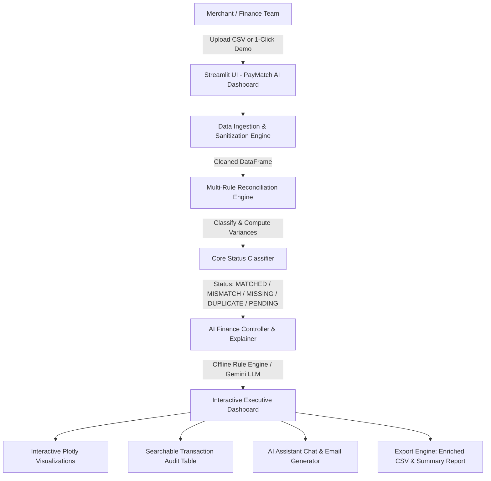

# 💳 PayMatch AI — Smart Payment Reconciliation & Finance Controller

[](https://razorpay.com)
[](https://python.org)
[](https://streamlit.io)
[](https://plotly.com)

> **Autonomous AI-powered payment reconciliation engine designed for modern merchants and finance teams.**
> Automatically match invoices against payment gateway settlements, detect fee deductions & variances, flag duplicate charges, and draft instant recovery actions.

---

## 📌 Problem Statement

Finance teams and merchants process thousands of customer transactions monthly across UPI, credit cards, netbanking, and payment gateways. Currently, **over 80% of businesses reconcile payments manually using complex spreadsheets**, which leads to:
1. **Uncollected Revenue:** Invoices generated but unpaid or failed at gateway level go unnoticed for weeks.
2. **Hidden MDR & Gateway Fee Discrepancies:** Standard 2% MDR fees or GST deductions are manually confused with customer underpayments.
3. **Double Charges & Chargeback Risk:** Duplicate gateway processing creates unhappy customers and dispute penalties.
4. **Time Drain:** Finance teams waste 30–50 hours every month manually cross-referencing invoice IDs with bank settlement dumps.

---

## 💡 Solution: PayMatch AI

**PayMatch AI** acts as an autonomous **AI Finance Controller**:
* **Instant Multi-Rule Reconciliation:** Ingests transaction reports or separate invoice/settlement CSVs and matches records within seconds.
* **Deterministic Root-Cause Analysis:** Identifies standard Razorpay 2% MDR gateway fee deductions, 18% GST withholdings, partial installments, and overpayments without guessing.
* **Zero-Failure AI Assistant:** Features a 100% reliable deterministic rule intelligence engine (works completely offline with zero API keys) with an optional Google Gemini LLM integration for conversational financial querying.
* **Actionable Recovery Engine:** Auto-generates ready-to-send polite reminder and refund emails with payment links.
* **Executive Audit Reports:** Download enriched CSVs and Executive Summary Markdown reports for leadership and audit compliance.

---

## 🚀 Key Features

| Feature | Description |
| :--- | :--- |
| **📊 Executive Dashboard** | Real-time KPI cards for Invoiced Value, Received Funds, Reconciliation Rate (%), and Total Discrepancy Risk. |
| **⚡ Multi-Rule Engine** | Classifies records into `MATCHED`, `MISMATCH`, `MISSING PAYMENT`, `DUPLICATE`, and `PENDING`. |
| **🧠 AI Finance Assistant** | Interactive chat for root-cause diagnosis, top risk exposure discovery, and resolution recommendations. |
| **📈 Visual Analytics** | Interactive Plotly Donut breakdowns, Payment Channel performance bars, and Daily settlement timelines. |
| **🔍 Searchable Audit Table** | Instant search by Txn ID, Invoice ID, or Customer name with dynamic risk badges. |
| **✉️ 1-Click Outreach Drafter** | Generates context-aware customer emails with payment links for missing and short payments. |
| **📥 Export Center** | One-click export for enriched reconciliation CSVs and formatted Executive Summaries. |
| **🛡️ Bulletproof Error Handling** | Gracefully handles empty files, malformed headers, invalid date strings, and currency symbols (`₹`, `$`). |

---

## 🏗️ System Architecture



---

## 📂 Project Structure

```
paymatch-ai/
│
├── app.py                      # Main Streamlit application & interactive dashboard
├── requirements.txt            # Python dependencies
├── README.md                   # Project documentation & track details
├── PITCH.md                    # 5-minute hackathon pitch & interview guide
├── DEMO_SCRIPT.md              # Step-by-step live demo walkthrough script
├── .gitignore                  # Git ignore configuration
├── .env.example                # Environment variable template
│
├── sample_data/
│   ├── sample_transactions.csv # 45+ realistic Indian transactions (₹, UPI, Cards, Netbanking)
│   ├── sample_invoices.csv     # Separate Invoices sample (for 2-file reconciliation)
│   └── sample_payments.csv     # Separate Gateway Settlements sample
│
├── src/
│   ├── __init__.py
│   ├── reconciliation.py       # Core reconciliation logic, MDR fee detection & risk scoring
│   ├── ai_assistant.py         # AI Root Cause Analysis (Rule-based fallback + Gemini LLM)
│   ├── insights.py             # Plotly financial charts & priority resolution queue
│   └── utils.py                # CSV validation, INR currency formatting & report generators
│
├── tests/
│   ├── __init__.py
│   └── test_reconciliation.py  # Automated unit test suite
│
└── screenshots/
    └── .gitkeep                # UI screenshots directory
```

---

## ⚙️ Installation & How to Run

### Step 1: Clone or Navigate to the Project
```bash
cd paymatch-ai
```

### Step 2: Create and Activate a Virtual Environment (Recommended)
```bash
# Windows
python -m venv venv
venv\Scripts\activate

# Mac/Linux
python3 -m venv venv
source venv/bin/activate
```

### Step 3: Install Dependencies
```bash
pip install -r requirements.txt
```

### Step 4: Run the Application
```bash
streamlit run app.py
```

The application will open automatically in your default browser at `http://localhost:8501`.

---

## 🧪 Running Automated Tests

Verify reconciliation logic, fee detection, duplicate detection, and formatting:
```bash
python -m unittest tests/test_reconciliation.py
```

---

## 📄 Expected CSV Format

PayMatch AI accepts both single unified transaction files and dual invoice/payment files.

### Standard Single File Format:
```csv
transaction_id,invoice_id,customer_name,invoice_amount,paid_amount,payment_date,payment_method,status
TXN-1001,INV-2026-001,Aarav Sharma,5000.00,5000.00,2026-08-01,Razorpay UPI,SUCCESS
TXN-1002,INV-2026-002,Pooja Patel,12500.00,12500.00,2026-08-02,Credit Card,SUCCESS
TXN-1003,INV-2026-003,Rohan Mehta,7800.00,7644.00,2026-08-02,Razorpay Cards,SUCCESS
TXN-1005,INV-2026-005,Ananya Iyer,3200.00,0.00,2026-08-03,None,PENDING
TXN-1010,INV-2026-010,Deepak Joshi,4200.00,4200.00,2026-08-06,Razorpay UPI,SUCCESS
```

*Header aliases like `txn_id`, `inv_id`, `amount`, and `paid` are automatically recognized.*

---

## 🎯 Track 4 Relevance: AI Finance Controller

PayMatch AI directly addresses the core goals of **Track 4 — AI Finance Controller**:
1. **Autonomous Anomaly Detection:** Identifies revenue leakage, duplicate charges, and unpaid invoices without human intervention.
2. **Context-Aware Financial Intelligence:** Distinguishes between intentional platform deductions (MDR / GST) and customer underpayments.
3. **Closing the Loop:** Doesn't just report issues—drafts recovery actions and customer emails with payment links.

---

## 🔮 Future Improvements & Roadmap

* **Live Razorpay Webhook Ingestion:** Real-time reconciliation as payment events (`payment.captured`, `refund.processed`) occur.
* **Automated WhatsApp / SMS Recovery Bot:** Auto-dispatch payment recovery links directly to customer phones.
* **ERP Connectors:** Direct bidirectional sync with TallyPrime, Zoho Books, QuickBooks, and SAP.
* **Multi-Currency Reconciliation:** Support international cross-border FX conversions and forex fee deductions.

---

## 👨‍💻 Author & Submission Details
* **Project Name:** PayMatch AI — Smart Payment Reconciliation & Finance Controller
* **Hackathon:** Razorpay Internship Hackathon 2026
* **Track:** Track 4 — AI Finance Controller
